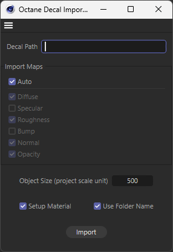

<p align="center">
  
</p>

# Octane Decal Importer
Octane for Cinema4D finaly supports decals as a seperate object.

However it's quite tideous having to import each and every image textures into the node graph, connect it to appropritate slots and maybe add any extra nodes to tweak the colors and intensity of those textures.

It's a nightmare when you dont know what you want and want to tryout bunch of different decals to see which looks the best. So I made this script which takes the path of material directory as input and creates an octane decale object from the available texture maps and even setups the active pbr material with decal texture nodes!

All the functionality is listed below in detail.

Or you can skip to the [Installation](#installation) part which is also dead simple.

Don't forget to checkout [Notes](#notes) section aswell.

<br>
<h3 align="center">
  ✦ Purchase & More Info → <a href="https://oblvyn.gumroad.com/l/octane_decal_importer"><u>GUMROAD</u></a> ✦
</h3>
<br>

## Features
<p align="center">
  
</p>

- Takes material/decal directory path as input.

- **Automatically connectes the active PBR material (outermost material tag) with the Decal object.**

- Supports selective texture maps imports or uses the available texture maps automatically by default.

- Can use the name of directory as decal object name.

- Automatically matches the size/ratio of decal object to the resolution of image textures

- Adds Color Correction Node and Gradient Nodes to Diffuse and Info maps respectively, fallbacks to float texture for unavailable texture maps.

<br>

## Limitations
- **Right now the 'Setup Material' feature only works for Octane Glossy Material. I am working on making it work for multiple types of materials (Specular, Diffuse, Universal).** For now you can just turn it off in dialog box when importing on any other material except glossy.

<br>

## Installation

1. Download and copy the whole folder `octane-decal-importer` .

1. Navigate to C4D scripts folder: `Extentions > User Scripts > Script Folder... (Open the 'scripts' folder)` .

1. Paste the folder.

1. Restart Cinema 4D.

1. Open the script manager: `Extentions > Script Manager (Shift + F11)` .

1. Load the script from 'Script' dropdown.

1. Press `Execute` .

1. Press `shortcut...` button at the bottom of script manager to add it as a shortcut to your C4D layout.

<br>

## Notes
- I tried my best to auto detect texture maps with ever absurd naming conventions but its never enough!<br>
So please try to keep/rename the image files with some simple yet clear channel name (preferably separated by an underscore '_').

- Decal texture may appear inverted, its due to some bug or poor implementation of decal object by OTOY, I dont have much control over it. <br>
You can just flip (180 degree) the Y axis or playaround with the rotation of decal object or texture projection to get it right.

- I am using displacement map for the bump input, as that is what I found looks the best to me.<br>
You can configure the maps by modifying `ALIASES` constant in the script.

- When using decals in a material with displacement you will see some artefact, thats not due to the script. that's just due to the overlaping of decal object and the polygonal object. I'll advice to not use displacement when using decals (I haven't implemented it by default anyways).

- The texture slots in decal object are reserved to the following texture maps for the sake of consistency.
    ```
    Texture 1 -> Diffuse
    Texture 2 -> Specular
    Texture 3 -> Roughness
    Texture 4 -> Bump
    ```

- If you encounter any error or have feature ideas you can let me know about it. I'll try to implement them it in a future release.

---
<br>
<h3 align="center">
  ✦ Purchase & More Info → <a href="https://oblvyn.gumroad.com/l/octane_decal_importer"><u>GUMROAD</u></a> ✦
</h3>
<br>
